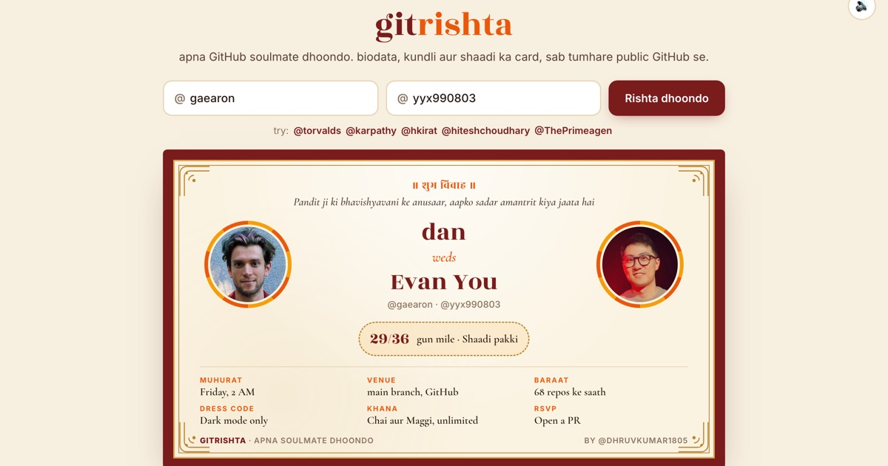

# gitrishta

apna GitHub soulmate dhoondo.

Type a GitHub username and Pandit ji reads your public profile, makes your rishta biodata and looks for your rishta in four places:

1. **Your GitHub circle**: people who follow you back first, then people you follow.
2. **All of GitHub**: developers with your stack (and country, when there are enough) and a follower count in your league, found through GitHub search.
3. **The rishta pool**: everyone who has made a biodata and opted in.
4. **Celebrities**: a snapshot of well-known developers.

The best kundli match gets a shaadi ka card. It's in English by default, with a Desi (Hinglish) mode one tap away.

**Live:** https://dhruvkumar.dev/gitrishta



## What it reads

Everything comes from the public GitHub API, in your browser. If you keep "add me to the rishta pool" ticked, a few numbers derived from your public profile (stars, repo count, top languages, the hour you commit most) are kept so other people can match with you. Untick it, or use "remove me from the pool" anytime.

| Biodata field | Comes from |
| --- | --- |
| Kad (height) | total stars |
| Gotra | top language |
| Rashi | the hour you commit the most |
| Manglik | pushes on Friday nights |
| Package | followers (not in-hand) |
| Sampatti | repos, and how many you abandoned |

The kundli scores 8 ashtakoot gunas (out of 36) from both profiles: shared languages, sleep schedules, weekend commits, stars, repo counts and GitHub age.

## Run locally

It's one static page.

```sh
python3 -m http.server 8787
```

`famous.js` is a snapshot of public data for the developers in the rishta pool, so suggestions don't use up your GitHub rate limit. Refresh or extend it with:

```sh
node build-famous.mjs torvalds gaearon yyx990803
```

Made by [@dhruvkumar1805](https://x.com/dhruvkumar1805). For fun, not for actual shaadi.
